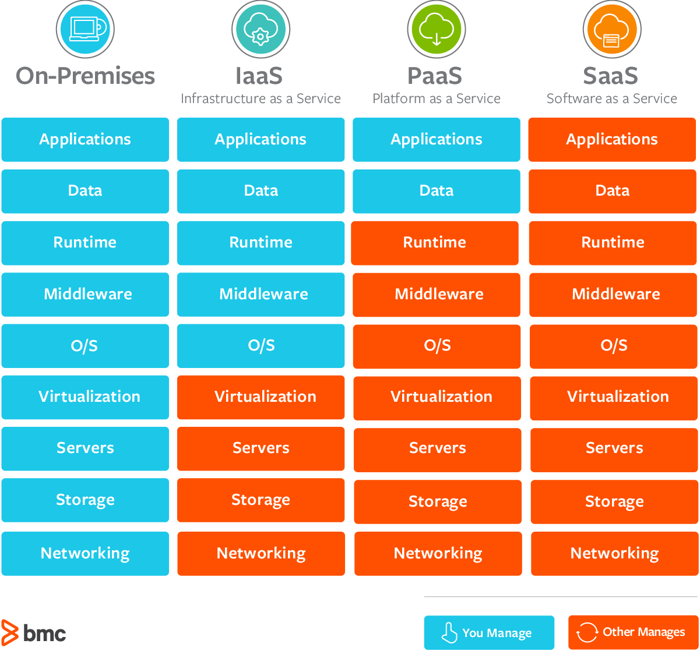
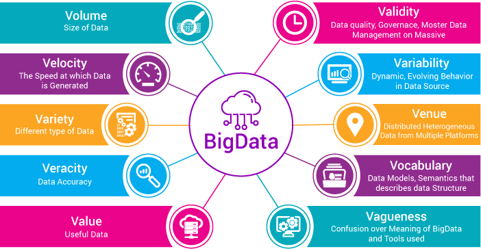

All Interview Questions
-----------------------

The interview questions are roughly structured like the sections in the
\"Basic data engineering skills\" part. This makes it easier to navigate
this document. I still need to sort them accordingly.

### SQL DBs

-   *What are windowing functions?*

According to PostgreSQL v.9 documentation, an SQL Window function performs a calculation across a set of table rows that are somehow related to the current row, in a way similar to aggregate functions.
A window function call always contains an OVER clause.

-   *What is a stored procedure? Why would you use them?*

A stored procedure is a prepared SQL code that you can save, so the code can be reused over and over again.

So if you have an SQL query that you write over and over again, save it as a stored procedure, and then just call it to execute it.

You can also pass parameters to a stored procedure, so that the stored procedure can act based on the parameter value(s) that is passed.
```
CREATE PROCEDURE SelectAllCustomers @City nvarchar(30)
AS
SELECT * FROM Customers WHERE City = @City
GO;
```

-   *What are atomic attributes?*

An attribute that cannot be divided further into meaningful subcomponents/sub-attributes is an Atomic attribute.
for example: First_name, last_name, gender of a person, year, door number etc...
-   *Explain ACID props of a database*

*Atomicity* means that either the entire transaction takes place at once or doesn’t happen at all. There is no midway i.e. transactions do not occur partially. 
Each transaction is considered as one unit and either runs to completion or is not executed at all. It involves following two operations.

*Consistency* means that integrity constraints must be maintained so that the database is consistent before and after the transaction. It refers to correctness of a database. 

*Isolation* ensures that multiple transactions can occur concurrently without leading to inconsistency of database state. 
Transactions occur independently without interference. 
Changes occurring in a particular transaction will not be visible to any other transaction until that particular change in that transaction is written to memory or has been committed. 
This property ensures that the execution of transactions concurrently will result in a state that is equivalent to a state achieved these were executed serially in some order.

*Durability* ensures that once the transaction has completed execution, the updates and modifications to the database are stored in and written to disk and they persist even if system failure occurs. 
These updates now become permanent and are stored in a non-volatile memory. The effects of the transaction, thus, are never lost.

-   *How to optimize queries?*

You can use `Explain Analyze` to study the details of each query. 
Some best practice you should follow:

1. Index all the predicates in JOIN, WHERE, ORDER BY and GROUP BY clauses. It is recommended that all predicate columns be indexed. The exception being where column data has very low cardinality.

2. Avoid using functions in predicates.
The index is not used by the database if there is a function on the column.
For example, `SELECT * FROM TABLE1 WHERE UPPER(COL1)='ABC'`

3. Avoid using wildcard (`%`) at the beginning of a predicate.
The predicate LIKE `%abc` causes full table scan. This is a known performance limitation in all databases.

4. Avoid unnecessary columns in SELECT clause. e.g. `SELECT *`
Specify the columns in the SELECT clause instead of using SELECT *.

5. Use inner join, instead of outer join if possible.
The outer join should only be used if it is necessary. 
Using outer join limits the database optimization options which typically results in slower SQL execution.

6. DISTINCT and UNION should be used only if it is necessary.
DISTINCT and UNION operators cause sorting, which slows down the SQL execution. 
Use UNION ALL instead of UNION, if possible, as it is much more efficient.

7. The ORDER BY clause is mandatory in SQL if the sorted result set is expected. Sorting is expensive.

-   *What are the different types of JOIN (CROSS, INNER, OUTER)?*


-   *What is the difference between Clustered Index and Non-Clustered
    Index - with examples?*
  
-- *Clustered Index*

Only one per table

Faster to read than non clustered as data is physically stored in index order

In an RDBMS, usually, the primary key allows you to create a clustered index based on that specific column.
 
-- *Non Clustered Index*

Can be used many times per table

Quicker for insert and update operations than a clustered index
Both types of index will improve performance when select data with fields that use the index but will slow down update and insert operations.

Because of the slower insert and update clustered indexes should be set on a field that is normally incremental ie Id or Timestamp.
```
CREATE [NONCLUSTERED] INDEX index_name
ON table_name(column_list);
```

- *Schema and 3 types of schemas*

Definition: Design of a database is called the schema. Schema is of three types: Physical schema, logical schema and view schema.


- *View and Temp tables*

Views are a logical virtual table created by “select query” but the result is not stored anywhere in the disk and every time we need to fire the query when we need data, 
so always we get updated or latest data from original tables.

- *View and Materialized View*

Views are a logical virtual table created by “select query” but the result is not stored anywhere in the disk and every time we need to fire the query when we need data, 
so always we get updated or latest data from original tables.

Materialized views are also the logical view of our data-driven by the select query but the result of the query will get stored in the table or disk, also the definition of the query will also store in the database.
When we see the performance of Materialized view it is better than normal View because the data of materialized view will be stored in table and table may be indexed so faster for joining also joining is done at the time of materialized views refresh time so no need to every time fire join statement as in case of view.

1) The first difference between View and materialized view is that In Views query result is not stored in the disk or database but Materialized view allow to store the query result in disk or table.
2) Another difference between View vs materialized view is that, when we create a view using any table, rowid of view is same as the original table but in case of Materialized view rowid is different.
3) One more difference between View and materialized view in the database is that In case of View we always get latest data but in case of Materialized view we need to refresh the view for getting latest data.
4) Performance of View is less than Materialized view.
5) This is continuation of first difference between View and Materialized View, In case of view its only the logical view of table no separate copy of table but in case of Materialized view we get physically separate copy of table.
6) Last difference between View vs Materialized View is that In case of Materialized view we need an extra trigger or some automatic method so that we can keep MV refreshed, this is not required for views in the database.

- *Truncate or Delete, what's the difference?*

1. truncate is fast delete is slow.
2. truncate doesn't do logging delete logs on per row basis.
3. rollback is possible with delete not with truncate until specifically supported by the vendor.
4. truncate doesn't fire trigger, delete does.
5. Don't delete, truncate it when it comes to purge tables.
6. truncate reset identity column in table if any, delete doesn't.
7. truncate is DDL while delete is DML (use this when you are writing exam)
8. truncate doesn't support where clause, delete does.

Read more: https://javarevisited.blogspot.com/2011/10/how-to-use-truncate-and-delete-command.html#ixzz65NQl4af9

- *Unique key or Primary key, what's the difference?*

1) Unique key in a table can be null, at-least one but the primary key cannot be null in any table in a relational database like MySQL, Oracle etc.

2) The primary key can be a combination of more than one unique keys in the same table.

3) There can be only one primary key per table in relation database e.g. MySQL, Oracle or Sybase but there can be more than one unique key per table.

4) The unique key is represented using unique constraint while a primary key is created using primary key constraint in any table and it's automatically got unique constraint.

### The Cloud

-   What is serverless?

Serverless architecture (also known as serverless computing or function as a service, FaaS) is a software design pattern where applications are hosted by a third-party service, eliminating the need for server software and hardware management by the developer. 
Applications are broken up into individual functions that can be invoked and scaled individually.

Serverless computing (or serverless for short), is an execution model where the cloud provider (AWS, Azure, or Google Cloud) is responsible for executing a piece of code by dynamically allocating the resources. 
And only charging for the amount of resources used to run the code. The code is typically run inside stateless containers that can be triggered by a variety of events including http requests, database events, queuing services, monitoring alerts, file uploads, scheduled events (cron jobs), etc. 
The code that is sent to the cloud provider for execution is usually in the form of a function. Hence serverless is sometimes referred to as “Functions as a Service” or “FaaS”.
e.g. AWS Lambda

You should especially consider using a serverless provider if you have a small number of functions that you need hosted. If your application is more complex, a serverless architecture can still be beneficial, but you will need to architect your application very differently. 

-   What is the difference between IaaS, PaaS and SaaS?



a) Infrastructure as a Service (IaaS) : It provides only a base infrastructure (Virtual machine, Software Define Network, Storage attached). End user have to configure and manage platform and environment, deploy applications on it.
AWS (EC2), GCP (CE), Microsoft Azure (VM) are examples of Iaas.

b) Platform as a Service (PaaS): It provides a platform allowing end user to develop, run, and manage applications without the complexity of building and maintaining the infrastructure.
Google App Engine, CloudFoundry, Heroku, AWS (Beanstalk) are some examples of PaaS.

c) Software as a Service (SaaS) : It is sometimes called to as “on-demand software”. Typically accessed by users using a thin client via a web browser. In SaaS everything can be managed by vendors: applications, runtime, data, middleware, OSes, virtualization, servers, storage and networking, End users have to use it.
GMAIL is Best example of SaaS. Google team managing everything just we have to use the application through any of client or in browsers. Other examples SAP, Salesforce .

d) Container as a Service (CaaS): Is a form of container-based virtualization in which container engines, orchestration and the underlying compute resources are delivered to users as a service from a cloud provider.
Google Container Engine(GKE), AWS (ECS), Azure (ACS) and Pivotal (PKS) are some examples of CaaS.

e) Function as a Service (FaaS): It provides a platform allowing customers to develop, run, and manage application functionalities without the complexity of building and maintaining the infrastructure.
AWS (Lamda), Google Cloud Function are some examples of Faas

https://brainhub.eu/blog/cloud-architecture-saas-faas-xaas/

- *What's the difference between PaaS and FaaS?*

PaaS, or Platform as a Service, products such as Heroku, Azure Web Apps and AWS Elastic Beanstalk offer many of the same benefits as Serverless (sometimes called Function as a Service or FaaS). They do eliminate the need for management of server hardware and software. The primary difference is in the way you compose and deploy your application, and therefore the scalability of your application.

With PaaS, your application is deployed as a single unit and is developed in the traditional way using some kind of web framework like ASP.NET, Flask, Ruby on Rails, Java Servlets, etc. Scaling is only done at the entire application level. You can decide to run multiple instances of your application to handle additional load.

With FaaS, you compose your application into individual, autonomous functions. Each function is hosted by the FaaS provider and can be scaled automatically as function call frequency increases or decreases. This turns out to be a very cost effective way of paying for compute resources. You only pay for the times that your functions get called, rather than paying to have your application always on and waiting for requests on so many different instances.

-   How do you move from the ingest layer to the Cosumption layer? (In
    Serverless)
    
https://www.xenonstack.com/blog/big-data-ingestion/

-   *What is edge computing?*

Edge computing is a distributed computing paradigm which brings computation and data storage closer to the location where it is needed, to improve response times and save bandwidth

Edge computing is the practice of processing data near the edge of your network, where the data is being generated, instead of in a centralized data-processing warehouse.
-   *What is the difference between cloud and edge and on-premise?*

Cloud computing is basically using a remote server for management, storage, and processing of the data.

In cloud computing, the data is sent to the cloud and located at a great distance from the point of origin. 
The cloud then processes this action and the data is pulled down from the cloud by the customers as and when needed.

Edge computing is often referred to as "on-premise." A computing topology in which information processing power, data collection, and delivery are moved closer to the edge of the device. Instead of housing processing power in a cloud or a centralized data center, data processing occurs in multiple small data centers located at or near the source. 
The main purpose of edge computing is to push the data as close to the actual device as possible, thus reducing traffic and latency.

### Linux

-   What is crontab?

The software utility cron is a time-based job scheduler in Unix-like computer operating systems. 

Cron is driven by a crontab (cron table) file, a configuration file that specifies shell commands to run periodically on a given schedule. The crontab files are stored where the lists of jobs and other instructions to the cron daemon are kept.


### Big Data

-   What are the 4 V's?


1. volume: size of data
2. velocity: the speed at which data is generated
3. variety: different type of data
4. veracity: accuracy of data


-   Which one is most important?

depends
### Kafka

-   *What is a topic?*

message feeds
-   *What is a producer?*

processes publishing to kafka topics

-  *What are consumers/consumer groups?*

processes subscribing to kafka topics
-   *How to ensure FIFO?*

topics can be divided into multiple partitions;
each partition is an in-order(FIFO) message queue.
partitions enable parallelism. 

kafka fault-tolerance occurs at the paritiion level
1. user configurable replication factor
2. each partition is replicated across that many brokers (nodes)
3. replicas designated as leaders or followers
4. leaders are load-balanced across cluster

-   *How do you know if all messages in a topic have been fully consumed?*


-   *What are brokers?*

nodes in a kafka cluster

-   *What are consumer groups?*

Consumer group is a multi-threaded or multi-machine consumption from Kafka topics.

Consumers can join a group by using the same `group.id`.

The maximum parallelism of a group is that the number of consumers in the group ← no of partitions.

Kafka assigns the partitions of a topic to the consumer in a group, so that each partition is consumed by exactly one consumer in the group.

Kafka guarantees that a message is only ever read by a single consumer in the group.

Consumers can see the message in the order they were stored in the log.


**Alternatives: Amazon kinesis, apache Flume(HDFS), Apache Pulsar**

### Coding

-   What is the difference between an object and a class?

*A class is a template for objects.* A class defines object properties including a valid range of values, and a default value. 
A class also describes object behavior. 

An object is a member or an "instance" of a class. An object has a state in which all of its properties have values that you either explicitly define or that are defined by default settings.
-   Explain immutability

-   What are AWS Lambda functions and why would you use them?

-   Difference between library, framework and package

-   How to reverse a linked list

-   Difference between args and kwargs

-   Difference between OOP and functional programming

### NoSQL DBs

-   *What is a key-value (row store) store?*

A key-value store, or key-value database is a simple database that uses an associative array (think of a map or dictionary) as the fundamental data model where each key is associated with one and only one value in a collection. This relationship is referred to as a key-value pair.
-   *What is a column store?*

-   Diff between Row and col.store

-   What is a document store?

-   Difference between Redshift and Snowflake

Amazon Redshift is a fully managed, petabyte-scale data warehouse service in the cloud. We use Amazon Redshift to load the data and run queries on the data.
built on top of Postgres
column-first and cluster-based, support query data from S3 directly, compatible with other AWS products.

Snowflake is a datawarehouse built on top of AWS or Microsoft Azure cloud platform.
Three layers architecture:
1. The database **storage layer** holds all data loaded into Snowflake, including structured and semistructured data.
2. The **compute layer** is made up of virtual warehouses that execute data processing tasks required for queries.
3. The **cloud services layer** uses ANSI SQL and coordinates the entire system.

Storage and support for structured and semistructured data

Snowflake automatically optimizes how the data is stored and queried.


*Similarities between the two*

Both Redshift and Snowflake leverage columnar storage

massively parallel processing (MPP) for simultaneous computation, enabling advanced analytics and saving significant time on sizable jobs.

AWS platform

On-demand pricing: pay as you go

### Hadoop

-   *What file formats can you use in Hadoop?*

-   *What is the difference between a name and a datanode?*

-   *What is HDFS?*

HDFS is a Java-based file system that provides scalable and reliable data storage, and it was designed to span large clusters of commodity servers.

HDFS holds a huge amount of data and provides easier access.

To store such massive data, the files are stored on multiple machines. These files are stored redundantly to rescue the system from possible data losses in case of failure.

HDFS also makes applications available for parallel processing. HDFS is built to support applications with large data sets, including individual files that reach into the terabytes.

It uses a **master/slave architecture**, with each cluster consisting of a single **NameNode** that manages file system operations and supporting **DataNodes** that manage data storage on individual compute nodes.

When HDFS takes in data, it breaks the information down into separate pieces and distributes them to different nodes in a cluster, allowing for **parallel processing**.

The file system also **copies** each piece of data multiple times and distributes the copies to individual nodes, placing at least one copy on a different server rack

HDFS and YARN from the data management layer of Apache Hadoop.

-   What is the purpose of YARN?

### Lambda Architecture

-   What is streaming and batching?

-   What is the upside of streaming vs batching?

-   What is the difference between lambda and kappa architecture?

-   Can you sync the batch and streaming layer and if yes how?

### Python

-   Difference between list, tuples and dictionary
1. list is mutable, ordered array can contain any type of objects
2. tuples are immutable ordered sequences of objects, can contain any type of objects
3. dictionary is a hash table, key-value pair, mutable and unordered
4. Sets are mutable unordered sequence of unique elements whereas frozensets are immutable sets.


Double-ended queues, or deques, can be useful when you need to remove elements in the order in which they were added.
### Data Warehouse & Data Lake
https://www.xenonstack.com/blog/big-data-ingestion/

-   *What is a data lake?*

It is a new type of **cloud-based** enterprise architecture that structures data in a more scalable way that makes it easier to experiment with it.

With a data lake, incoming data goes into the lake in a **raw form** or whatever form data source providers, and there we select and organize the data in a raw form. There are no assumptions about the schema of the data; each data source can use whatever scheme it likes.

It’s up to the consumers of that information to make sense of that data for their purposes. The idea is to have a single store for all of the raw data that anyone in an organization might need to analyze.

To capture and store raw data at scale for a low cost

To store many types of data in the same repository

To perform transformations on the data

To define the structure of the data at the time, it is used, referred to as schema

-   *What is a data warehouse?*

A Data Warehouse is a subject-oriented, Integrated, Time-varying, non-volatile collection of data in support of management’s decision-making process.

So, a Data Warehouse is a centralized repository that stores data from multiple information sources and transforms them into a standard, 
multidimensional data model for efficient querying and analysis.

-  *Data lake Vs. Data Warehouse*

With Data Lake incoming data goes into the lake in the raw form and then, we select and organize the data in a raw form. 
In Data Warehouse Data is cleaned and organized into single consistent schema before putting them into a warehouse and then the analysis is done on the warehouse data.

Data lakes retain all data. Not only the data that is in use but also data that it might use in the future. 
On the other hand, when a data warehouse is being developed, considerable time is spent in analyzing different data sources, 
along with understanding business processes and profiling of data. 
Data is kept in its raw form and is only transformed when it is ready to be used.

In Data Lake all data in a data lake is stored in its natural form. 
Also, the data is always accessible to someone in need of it. In Data Warehouses difficulty faced when trying to induce a change in them. 
A lot of time is spent during development to get the structure of the warehouse right. 
Although a good warehouse design is capable of adapting to change.

-   *Are there data lake warehouses?*


-   *Two data lakes within single warehouse?*

-   *What is a data mart?*

A data mart is a subject-oriented database that is often a partitioned segment of an enterprise data warehouse. 
The subset of data held in a data mart typically aligns with a particular business unit like sales, finance, or marketing. 
Data marts accelerate business processes by allowing access to relevant information in a data warehouse or operational data store within days, as opposed to months or longer. 
Because a data mart only contains the data applicable to a certain business area, it is a cost-effective way to gain actionable insights quickly.

Data marts and data warehouses are both highly structured repositories where data is stored and managed until it is needed. 
However, they differ in the scope of data stored: data warehouses are built to serve as the central store of data for the entire business, 
whereas a data mart fulfills the request of a specific division or business function.

There are three types of data marts: dependent, independent, and hybrid. 
They are categorized based on their relation to the data warehouse and the data sources that are used to create the system.

-   *What is a slow changing dimension (types)?*

-   *What is a surrogate key and why use them?*

A **primary key** is a unique identifier given to a record in our database, 
which we can use when querying the database or in order to join multiple sources. 

A **natural key** is a key that has contextual or business meaning (for example, in a table containing STORE, SALES, and DATE, 
we might use the DATE field as a natural key when joining with another table detailing inventory).

A **surrogate key** is a key which does not have any contextual or business meaning. 
It is manufactured “artificially” and only for the purposes of data analysis.
 The most frequently used version of a surrogate key is an increasing sequential integer or “counter” value (i.e. 1, 2, 3). 
 Surrogate keys can also include the current system date/time stamp, or a random alphanumeric string.

Advantages of using surrogate keys:
1. Surrogate keys are unique.
2. Surrogate keys apply uniform rules to all records.
3. Surrogate keys stand the test of time.
4. Surrogate keys allow for unlimited values.

-  *What are the two most common data warehouse models*

The star schema and the snowflake schema are ways to organize data marts or entire data warehouses using relational databases. 
Both of them use dimension tables to describe data aggregated in a fact table.
The most obvious characteristic of the star schema is that dimension tables are not normalized.

This snowflake schema stores exactly the same data as the star schema. 
The fact table has the same dimensions as it does in the star schema example. 
The most important difference is that the dimension tables in the snowflake schema are normalized. 
Interestingly, the process of normalizing dimension tables is called snowflaking.

The First Difference: Normalization
The Second Difference: Query Complexity


### APIs (REST)

-   *What does REST mean?*

REST is acronym for REpresentational State Transfer. 
It is architectural style for distributed hypermedia systems and was first presented by Roy Fielding in 2000

Guiding Principles of REST
1. Client-Server: There should be a separation between the server that offers a service, and the client that consumes it.
2. Stateless: Each request from a client must contain all the information required by the server to carry out the request. In other words, the server cannot store information provided by the client in one request and use it in another request.
3. Cacheable: The server must indicate to the client if requests can be cached or not.
4. Layered System: Communication between a client and a server should be standardized in such a way that allows intermediaries to respond to requests instead of the end server, without the client having to do anything different.
5. Uniform Interface: The method of communication between a client and a server must be uniform.
6. Code on demand: Servers can provide executable code or scripts for clients to execute in their context. This constraint is the only one that is optional.

-   *What is idempotency?*

-   *What are common REST API frameworks (Jersey and Spring)?*

### Apache Spark

-   *What is an RDD?*

RDD (Resilient Distributed Dataset) is the fundamental data structure of Apache Spark which are an immutable collection of objects which computes on the different node of the cluster. 
Each and every dataset in Spark RDD is logically partitioned across many servers so that they can be computed on different nodes of the cluster.

-   *What is a dataframe?*

A DataFrame is a distributed collection of data organized into named columns. 
It is conceptually equal to a table in a relational database.

-   *What is a dataset?*

It is an extension of DataFrame API that provides the functionality of type-safe, 
object-oriented programming interface of the RDD API and performance benefits of the Catalyst query optimizer and off heap storage mechanism of a DataFrame API.
Only Scala and Java API supported.

-   *How is a dataset typesafe?*

-   *What is Parquet?*

columnar file format, fast read (slower writing), compatible with Spark
compressible well

-   *What is Avro?*

row file format, 

-   *Difference between Parquet and Avro*

-   *Tumbling Windows vs. Sliding Windows*

-   *Difference between batch and stream processing*

-   *What are microbatches?*


### MapReduce

-   What is a use case of mapReduce?

-   Write a pseudo code for wordcount

-   What is a combiner?

### Docker & Kubernetes

-   What is a container?

-   Difference between Docker Container and a Virtual PC

-   What is the easiest way to learn kubernetes fast?

### Data Pipelines

-   What is an example of a serverless pipeline?

-   What is the difference between at most once vs at least once vs
    exactly once?

-   What systems provide transactions?

-   What is a ETL pipeline?

### Airflow

-   What is a DAG (in context of airflow/luigi)?
Directed Acyclic Graph

-   What are hooks/is a hook?

-   What are operators?

-   How to branch?

### DataVisualization

-   What is a BI tool?
Business Intelligent tool

### Security/Privacy

-   What is Kerberos?

-   What is a firewall?

-   What is GDPR?
Guideline data protection rules?

-   What is anonymization?

### Distributed Systems

-   How clusters reach consensus (the answer was using consensus
    protocols like Paxos or Raft). Good I didnt have to explain paxos

-   What is the cap theorem / explain it (What factors should be
    considered when choosing a DB?)

-   How to choose right storage for different data consumers? It's
    always a tricky question

### Apache Flink

Apache Flink is an open-source framework for distributed stream processing that Provides results that are accurate, even in the case of out-of-order or late-arriving data. Some of its features are –

It is **stateful** and **fault-tolerant** and can seamlessly recover from failures while maintaining **exactly-once** application state.
Performs at large scale, running on thousands of nodes with excellent throughput and latency characteristics.
It’s streaming data flow execution engine, APIs and domain-specific libraries for Batch, Streaming, Machine Learning, and Graph Processing.

-   *What is Flink used for?*

1. Optimization of e-commerce search results in real-time
2. Stream processing-as-a-service for data science teams
3. Network/Sensor monitoring and error detection
4. ETL for Business Intelligence Infrastructure

-   Flink vs Spark?


### GitHub

-   What are branches?

-   What are commits?

-   What's a pull request?

### Dev/Ops

-   What is continuous integration?

-   What is continuous deployment?

-   Difference CI/CD

### Development / Agile

-   What is Scrum?

-   What is OKR?

-   What is Jira and what is it used for?